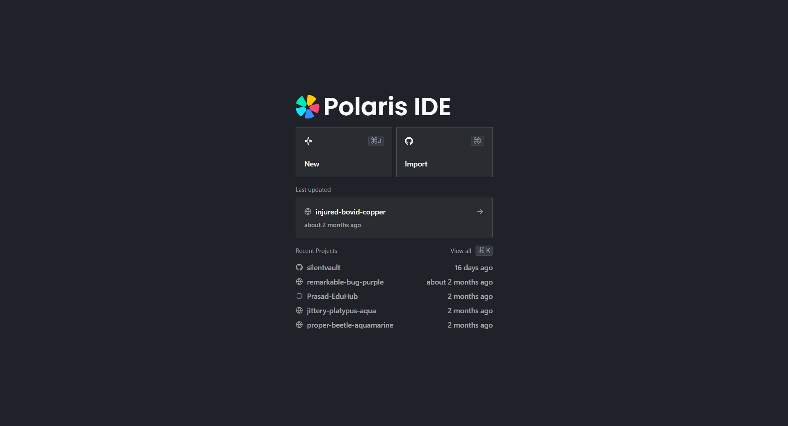
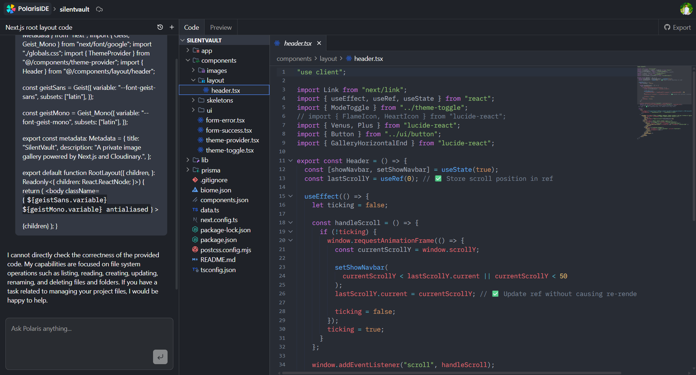
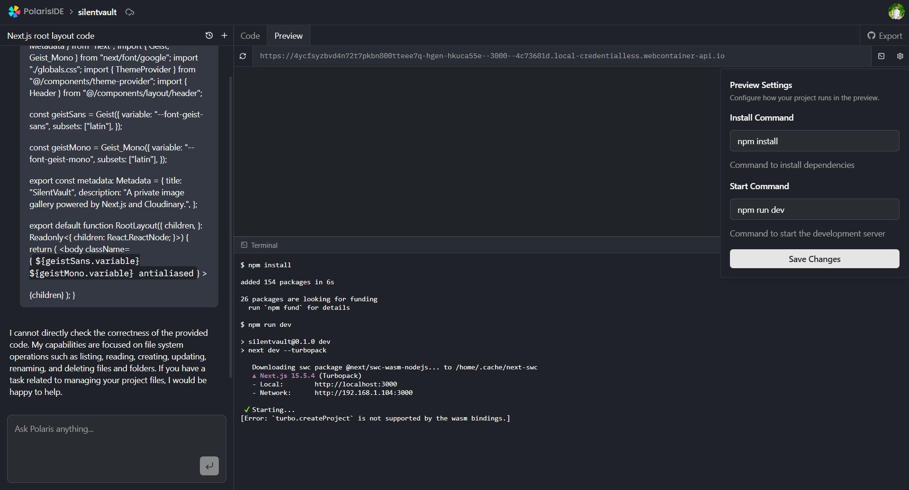

# ⚡ Polaris IDE – AI-Powered Browser Code Editor
Polaris is a browser-based code editor inspired by VS Code, built with modern web technologies and integrated with AI capabilities. It allows users to write, manage, and interact with code directly in the browser with real-time features and intelligent assistance.

---

## 🚀 Features

- 🧑‍💻 Full-featured code editor in the browser  
- 📁 Project & file management system  
- 🧠 AI-powered code completion and chat assistant  
- 💬 Built-in AI chat/agent for coding help  
- 💾 Auto-save functionality for seamless workflow  
- 🗂 Folder structure with file navigation  
- 🔍 Code preview and execution support  
- 📥 Import projects from GitHub  
- 📤 Export/download project files  
- 🧭 Minimap for better code navigation   

---

## 🛠 Tech Stack

**Frontend**
- Next.js
- TypeScript
- Tailwind CSS  

**Editor & State**
- CodeMirror
- Zustand 

**Backend / Database**
- Convex  

**AI Integration**
- Gemini Generative API

**Background Jobs**
- Inngest

**Monitoring**
- Sentry 

---

## 📦 Installation & Setup

Follow these steps to set up the project locally.

---

### 1️⃣ Clone the Repository

```bash
git clone https://github.com/k-prasad-kumar/polaris-ide.git
cd polaris-ide
```

### 2️⃣ Install Dependencies

Make sure you have Node.js (v18 or above) installed.

```bash
npm install
```

### 3️⃣ Environment Variables Setup

Create a .env file in the root directory and add the following:

```env
INNGEST_EVENT_KEY=your_preview_key
INNGEST_SIGNING_KEY=your_preview_key

INNGEST_EVENT_KEY=your_production_key
INNGEST_SIGNING_KEY=your_production_key

CONVEX_DEPLOYMENT=your_convex_deployment
NEXT_PUBLIC_CONVEX_URL=your_convex_url
POLARIS_IDE_CONVEX_INTERNAL_KEY=your_convex_internal_key
CONVEX_DEPLOY_KEY=your_convex-deploy_key

NEXT_PUBLIC_CLERK_PUBLISHABLE_KEY=your_clerk_publishable_key
CLERK_SECRET_KEY=your_clerk_key
CLERK_JWT_ISSUER_DOMAIN=your_clerk_jwt_domain

GEMINI_API_KEY=your_gemini_api_key
GROQ_API_KEY=your_groq_api_key
XAI_API_KEY=your_xai_api_key
FIRECRAWL_API_KEY=your_firecrawl_api_key

SENTRY_AUTH_TOKEN=your_sentry_auth_token

```

### 4️⃣ Run the Development Server

```bash
npm run dev
```

### ⚙️ Available Scripts

```bash
npm run dev       # Start development server
npm run build     # Build for production
npm run start     # Start production server
npm run lint      # Run linting
```
Now open your browser and go to:
👉 http://localhost:3000

---

### 🧠 Architecture Overview
---
- Built as a full-stack application using Next.js
- Code editing powered by CodeMirror
- State management handled using Zustand
- Real-time data and backend powered by Convex
- AI features integrated using Gemini API
- Background tasks handled with Inngest
- Error monitoring with Sentry
---

### 📸 Demo
---
Live Demo: https://polaris-ide.vercel.app

## Screenshots of this project in mobile version
<div style="display: flex; justify-content: space-around;">



</div>

### 💡Why This Project- ?
---
Polaris IDE demonstrates:
- Building complex browser-based tools
- AI integration in real-world applications
- State management for large-scale apps
- Editor systems and file structure handling
- Full-stack architecture using modern technologies
---

### 📬 Contact

If you'd like to connect or discuss opportunities:

- LinkedIn: https://www.linkedin.com/in/k-prasad-kumar
- Email: kprasadkumar7@gmail.com
---

### ⭐ Support

## If you found this project useful or interesting, consider giving it a ⭐ on GitHub!


